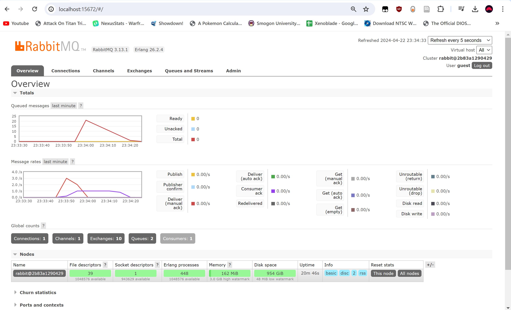

# Tutorial 8
1. What is **amqp**?
AMQP merupakan singkatan dari Advanced Messaging Queueing Protocol. AMQP digunakan oleh aplikasi untuk berkomunikasi secara asinkronus dalam satu jaringan. AMQP mendefinisikan sebuah protokol untuk bertukar pesan antar sistem. AMQP menyediakan suatu cara yang standar bagi aplikasi-aplikasi berbeda untuk berkomunikasi tanpa memperhatikan _platform_ atau bahasa pemrograman aplikasi tersebut. AMQP menyediakan fitur-fitur seperti _queueing_ dan _routing_ sehingga cocok digunakan untuk berbagai _use case_.
2. what it means? guest:guest@localhost:5672 , what is the first quest, and what is the second guest, and what is localhost:5672 is for?
Di atas, `guest` pertama merupakan username yang digunakan untuk autentikasi dengan broker AMQP. Kemudian, `guest` kedua merupakan password dari username tersebut. `localhost` merupakan hostname dari server AMQP yang ingin dihubungi. `5672` merupakan port dari server tersebut. Jadi, secara kesuluruhan, `guest:guest@localhost:5672` merupakan URL yang ingin menyambung ke server dengan hostname `localhost` pada port `5672` dengan username `guest` dan password `guest`.

### Slow Subscriber Simulation

Saya menjalankan program publisher sebanyak 5 kali jadi seharusnya ada 25 total pesan yang dikirim. Namun, jumlah queue-nya hanya 20. Ini kemungkinan terjadi karena 5 pesan pertama dapat masuk tanpa delay sedangkan 20 pesan lainnya harus menunggu.